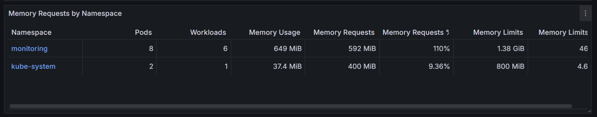
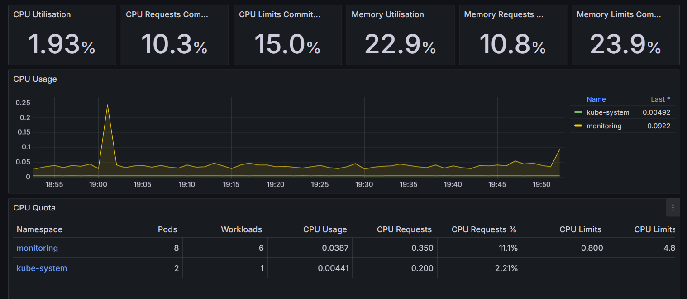
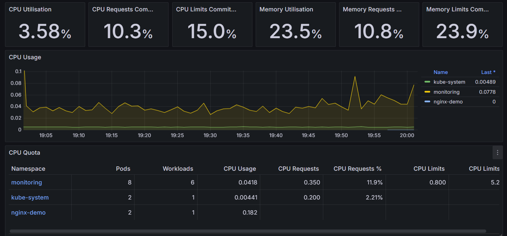
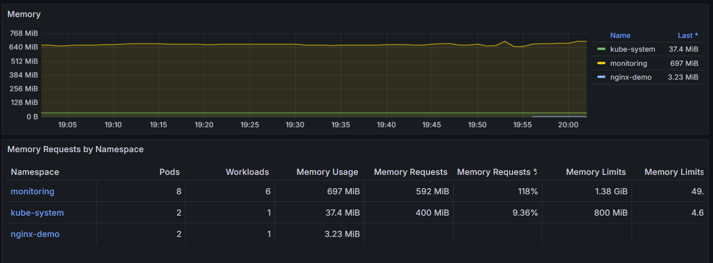

# Monitoreo de Infraestructura Kubernetes en AWS Academy

Pipeline de monitoreo de un clúster EKS que combina arquitectura **streaming** (Prometheus + Grafana + Alertmanager) y **batch** (Lambda → S3 Raw → Glue → S3 Curated → Athena).

---

## Arquitectura

```

```

---

## Prerrequisitos

Herramientas instaladas:

- AWS CLI configurado con credenciales de AWS Academy
- `kubectl`
- `helm` >= 3.x

Recursos creados previamente en AWS Academy:

| Recurso | Nombre | Detalle |
|---|---|---|
| VPC | `Infraestructure-vpc` | CIDR `172.16.0.0/16`, 2 AZs |
| Subred pública AZ-A | — | `172.16.1.0/24` |
| Subred pública AZ-B | — | `172.16.4.0/24` |
| Subred privada AZ-A | — | `172.16.2.0/24` |
| Subred privada AZ-B | — | `172.16.5.0/24` |
| EKS | `Infraestructure` | v1.35, subredes privadas, Auto Mode |
| S3 | `infrastucture-vbenitezz-dfsanchezv` | ACL habilitadas, acceso público no bloqueado |

> **Nota AWS Academy:** EKS se despliega con configuración rápida usando `LabEKSClusterRole` para el clúster y `LabEKSNodeRole` para los nodos.

---
## Parte 1 — Configurar kubectl

Después de haber creado la VPC, el Clúster de Kubernetes (EKS), el Bucket de S3 y haber iniciado sesión en AWS CLI, conecta `kubectl` al clúster EKS:

```powershell
aws eks update-kubeconfig --region us-east-1 --name Infraestructure
```

Verifica que los nodos están listos:

```powershell
kubectl get nodes
# Esperado: nodos en estado Ready
```

---

## Parte 2 — Stack de Monitoreo (Streaming)

Usamos el chart `kube-prometheus-stack` que instala Prometheus, Grafana y Alertmanager en un solo despliegue, preconfigurados para comunicarse entre sí.

### 2.1 Agregar el repositorio Helm

```powershell
helm repo add prometheus-community https://prometheus-community.github.io/helm-charts
helm repo update
```

### 2.2 Crear el namespace

```powershell
kubectl create namespace monitoring
```

### 2.3 Preparar el StorageClass

> **Por qué:** EKS Auto Mode usa el driver `ebs.csi.eks.amazonaws.com`, no el driver legacy `kubernetes.io/aws-ebs` del StorageClass `gp2` que viene por defecto. Sin este paso, todos los pods quedan en `Pending` por falta de volúmenes persistentes.

Situese en la carpeta `Proyecto` donde encontrará el archivo `storageclass.yaml`

Aplique el StorageClass y quita el default de `gp2`:

```powershell
kubectl apply -f storageclass.yaml

kubectl patch storageclass gp2 -p "{\"metadata\": {\"annotations\":{\"storageclass.kubernetes.io/is-default-class\":\"false\"}}}"
```

Verifica:

```powershell
kubectl get storageclass
# ebs-gp3 debe aparecer como (default)
```

### 2.4 Instalar el chart

Situado en la carpeta `Proyecto`encontrará el archivo `monitoring-values.yaml` el cual contendrá las instrucciones para la instalación de Prometheus, Grafana y AlertManager. Ejecute el siguiente comando para ejecutar su instalación:

```powershell
helm install monitoring prometheus-community/kube-prometheus-stack `
  --namespace monitoring `
  --values monitoring-values.yaml `
  --version 65.1.1
```

> La versión está fijada para garantizar reproducibilidad.

### 2.6 Verificar la instalación

```powershell
kubectl get pods -n monitoring
```

Espera ~3 minutos. Todos los pods deben estar en `Running`:

```
alertmanager-monitoring-kube-prometheus-alertmanager-0   2/2   Running
monitoring-grafana-xxxx                                  3/3   Running
monitoring-kube-prometheus-operator-xxxx                 1/1   Running
monitoring-kube-state-metrics-xxxx                       1/1   Running
monitoring-prometheus-node-exporter-xxxx                 1/1   Running  (uno por nodo)
prometheus-monitoring-kube-prometheus-prometheus-0       2/2   Running
```

Verifica que los PVCs están en `Bound`:

```powershell
kubectl get pvc -n monitoring
# STORAGECLASS debe mostrar ebs-gp3 y STATUS debe ser Bound
```

### 2.7 Acceder a las interfaces

Las subredes son privadas, se accede mediante port-forward. Abre **tres terminales separadas**:

```powershell
# Terminal 1 — Grafana: http://localhost:3000
kubectl port-forward svc/monitoring-grafana 3000:80 -n monitoring

# Terminal 2 — Prometheus: http://localhost:9090
kubectl port-forward svc/monitoring-kube-prometheus-prometheus 9090:9090 -n monitoring

# Terminal 3 — Alertmanager: http://localhost:9093
kubectl port-forward svc/monitoring-kube-prometheus-alertmanager 9093:9093 -n monitoring
```

Credenciales Grafana:
- **Usuario:** `admin`
- **Contraseña:** `Admin1234!`

> **Nota:** El port-forward no es persistente. Si cierras la terminal, debes volver a ejecutarlo.

### 2.8 Dashboards disponibles en Grafana

Ve a **Dashboards → Browse**. Los siguientes vienen preconfigurados:

| Dashboard | Qué muestra |
|---|---|
| `Kubernetes / Nodes` | CPU, RAM, disco y red por nodo |
| `Kubernetes / Pods` | Estado y recursos por pod |
| `Kubernetes / Compute Resources / Cluster` | Vista global del clúster |
| `Node Exporter / Full` | Métricas del SO de cada nodo |

Ve a **Alerting → Alert rules** para ver las ~30 alertas preconfiguradas.

---

## Parte 3 — Pipeline Batch

### 3.1 Preparar el bucket S3

El bucket debe tener las carpetas `raw/` y `curated/`. Verifica:

```powershell
aws s3 ls s3://infrastucture-vbenitezz-dfsanchezv/
# Debe aparecer: PRE curated/  y  PRE raw/
```

Si no existen, créalas:

```powershell
aws s3api put-object --bucket infrastucture-vbenitezz-dfsanchezv --key raw/
aws s3api put-object --bucket infrastucture-vbenitezz-dfsanchezv --key curated/
aws s3api put-object --bucket infrastucture-vbenitezz-dfsanchezv --key athena-results/
```

### 3.2 Exponer Prometheus con NLB interno

> **Por qué:** Lambda no puede alcanzar la ClusterIP de Kubernetes (`10.x.x.x`) porque es una IP interna del plano de red del clúster, no enrutable desde fuera. Se necesita un Network Load Balancer interno dentro de la misma VPC.

Primero agrega los tags requeridos a las subredes privadas para que el Load Balancer Controller pueda encontrarlas:

```powershell
# Subred privada us-east-1a
aws ec2 create-tags `
    --resources subnet-0e978a63f7818da75 `
    --tags Key=kubernetes.io/role/internal-elb,Value=1 `
    --region us-east-1

# Subred privada us-east-1b
aws ec2 create-tags `
    --resources subnet-0d36840cae3c847b3 `
    --tags Key=kubernetes.io/role/internal-elb,Value=1 `
    --region us-east-1
```

> **Reemplaza** los IDs de subred con los de tu VPC. Obtenlos con:
> ```powershell
> aws ec2 describe-subnets --filters "Name=tag:Name,Values=*private*" `
>     --query "Subnets[*].[SubnetId,AvailabilityZone,CidrBlock]" --output table
> ```

Situado en la carpeta `Proyecto`encontrará el archivo  `prometheus-lb.yaml` el cual crea un Network Load Balancer interno dentro de la VPC para exponer Prometheus:

Aplica y espera ~2 minutos:

```powershell
kubectl apply -f prometheus-lb.yaml
kubectl get svc prometheus-internal-lb -n monitoring
```

Cuando aparezca el hostname en `EXTERNAL-IP`, guárdalo:

```
NAME                     TYPE           CLUSTER-IP     EXTERNAL-IP
prometheus-internal-lb   LoadBalancer   10.100.x.x     k8s-monitori-promethe-xxxx.elb.us-east-1.amazonaws.com
```

### 3.3 Agregar regla de Security Group

> **Por qué:** Lambda usa el Security Group `default` de la VPC. El Security Group del EKS bloquea el tráfico entrante por defecto. Sin esta regla, Lambda recibe timeout al intentar conectarse a Prometheus.

Obtén los IDs de Security Groups:

```powershell
aws ec2 describe-security-groups `
    --filters "Name=vpc-id,Values=<TU_VPC_ID>" `
    --query "SecurityGroups[*].[GroupId,GroupName]" --output table
```

Agrega la regla (permite puerto 9090 desde el SG default hacia el SG del EKS):

```powershell
aws ec2 authorize-security-group-ingress `
    --group-id <SG_EKS> `
    --protocol tcp `
    --port 9090 `
    --source-group <SG_DEFAULT> `
    --region us-east-1
```

> Reemplaza `<SG_EKS>` con el ID del security group `eks-cluster-sg-Infraestructure-*` y `<SG_DEFAULT>` con el ID del security group `default`.

### 3.4 Crear la función Lambda

En el archivo deploy_lambd.ps1, reemplaza `$SUBNET_1`, `$SUBNET_2` con los valores de los IDs las subnets privadas y `$SG` con el ID del SecurityGroup default de tu VPC.

Despliega:

```powershell
cd lambda
.\deploy_lambda.ps1
```

### 3.5 Probar Lambda

```powershell
aws lambda invoke `
    --function-name prometheus-metrics-collector `
    --region us-east-1 `
    --cli-read-timeout 120 `
    response.json

cat response.json
# Esperado: {"statusCode": 200, "key": "raw/prometheus/year=.../metrics_....json"}
```

> **Usa `--cli-read-timeout 120`** para evitar que el CLI se desconecte antes de que Lambda termine (la función tarda ~60 segundos en recolectar todas las métricas).

Verifica que el archivo llegó a S3:

```powershell
aws s3 ls s3://infrastucture-vbenitezz-dfsanchezv/raw/prometheus/ --recursive
# El archivo debe tener ~117KB. Si pesa ~390 bytes, Prometheus aún no tiene datos — espera 2 minutos y reintenta.
```

### 3.6 Crear el Glue Job

Sube el script del job de Glue que se encuentra en el archivo glue/glue_job.py al bucket de S3 `s3://infrastucture-vbenitezz-dfsanchezv/glue/scripts/`

Ejecuta el siguiente comando estando en la carpeta `Proyecto` para crear el Job en Glue:

```powershell
$ROLE_ARN = "arn:aws:iam::$(aws sts get-caller-identity --query Account --output text):role/LabRole"

aws glue create-job `
    --name "prometheus-raw-to-curated" `
    --role $ROLE_ARN `
    --command file://glue/glue_config.json `
    --default-arguments file://glue/glue_args.json `
    --glue-version "4.0" `
    --number-of-workers 2 `
    --worker-type "G.1X" `
    --region us-east-1
```

### 3.7 Probar el Glue Job manualmente

```powershell
aws glue start-job-run `
    --job-name "prometheus-raw-to-curated" `
    --region us-east-1
```

Monitorea cada minuto hasta ver `SUCCEEDED`:

```powershell
aws glue get-job-runs `
    --job-name "prometheus-raw-to-curated" `
    --region us-east-1 `
    --query "JobRuns[0].[JobRunState,ErrorMessage]" `
    --output table
```

Verifica los parquet en S3:

```powershell
aws s3 ls s3://infrastucture-vbenitezz-dfsanchezv/curated/prometheus/ --recursive
```

---

## Parte 4 — Athena + Glue Data Catalog (por consola)

### 4.1 Crear la base de datos

Ve a **AWS Glue → Data Catalog → Databases → Add database**:
- **Name:** `prometheus_metrics`

### 4.2 Crear la tabla con un Crawler

> **Por qué Crawler y no tabla manual:** El Crawler infiere el schema real del Parquet automáticamente, evitando errores de tipo (`string` vs `double`) que causan `HIVE_CURSOR_ERROR` al consultar con Athena.

Ve a **AWS Glue → Crawlers → Create crawler**:

1. **Name:** `prometheus-curated-crawler`
2. **Data source:** S3 → `s3://infrastucture-vbenitezz-dfsanchezv/curated/prometheus/`
   - Subsequent crawler runs: **Crawl all sub-folders**
3. **IAM Role:** `LabRole`
4. **Target database:** `prometheus_metrics`
5. **Create crawler** → **Run crawler**

Cuando termine verás `1 table created`. La tabla se llamará `prometheus`.

### 4.3 Consultar con Athena

Ve a **Amazon Athena → Query editor**:

Configura el resultado si es la primera vez:
- **Settings → Query result location:** `s3://infrastucture-vbenitezz-dfsanchezv/athena-results/`

Selecciona la base de datos `prometheus_metrics` en el panel izquierdo y ejecuta:

```sql
-- Cargar particiones
MSCK REPAIR TABLE prometheus_metrics.prometheus;
```

```sql
-- Ver datos
SELECT metric_name, value, collected_at
FROM prometheus_metrics.prometheus
LIMIT 20;
```

```sql
-- Resumen estadístico por métrica
SELECT
    metric_name,
    AVG(value)   AS promedio,
    MIN(value)   AS minimo,
    MAX(value)   AS maximo,
    COUNT(*)     AS total_registros
FROM prometheus_metrics.prometheus
GROUP BY metric_name;
```

---

## Parte 5 — Automatización

### Invocar Lambda manualmente

```powershell
aws lambda invoke `
    --function-name prometheus-metrics-collector `
    --region us-east-1 `
    --cli-read-timeout 120 `
    response.json
```

Lambda automáticamente dispara el Glue Job al finalizar.

### Scheduler (producción)

**Nota AWS Academy:** EventBridge está bloqueado por la política `voc-cancel-cred` del entorno de laboratorio. Por lo que no fue posible programar su ejecución

## Prueba con NGINX

Métricas antes de subir NGINX:



Después de subir NGINX y enviar peticiones en bucle: kubectl exec -it nginx-deployment-77bc6bd484-s69c7 -n nginx-demo -- /bin/bash -c "while true; do cat /dev/urandom | head -c 1000; done"



## Estructura del repositorio

```
Proyecto/
├── storageclass.yaml           # StorageClass para EKS Auto Mode
├── monitoring-values.yaml      # Valores del chart kube-prometheus-stack
├── prometheus-lb.yaml          # NLB interno para exponer Prometheus
├── lambda/
│   ├── lambda_function.py      # Función Lambda
│   └── deploy_lambda.ps1       # Script de despliegue
├── glue/
│   ├── glue_job.py             # Script PySpark de transformación
│   ├── glue_config.json        # Configuración del Glue Job
│   └── glue_args.json          # Argumentos del Glue Job
└── README.md
```

## Referencias

- [kube-prometheus-stack – ArtifactHub](https://artifacthub.io/packages/helm/prometheus-community/kube-prometheus-stack)
- [EKS Auto Mode Storage](https://docs.aws.amazon.com/eks/latest/userguide/auto-storage.html)
- [Amazon EBS CSI Driver](https://docs.aws.amazon.com/eks/latest/userguide/ebs-csi.html)
- [AWS Glue PySpark Transforms](https://docs.aws.amazon.com/glue/latest/dg/aws-glue-programming-python.html)
- [Amazon Athena – Partitioned Tables](https://docs.aws.amazon.com/athena/latest/ug/partitions.html)